# 📱 Pedix API - Comanda Digital Inteligente

## 📝 Descrição do Projeto
O **Pedix** é uma aplicação backend desenvolvida em **Java com Spring Boot** que gerencia pedidos e itens de cardápio em restaurantes, lanchonetes ou serviços de alimentação.  
A aplicação permite criar, consultar, atualizar e deletar pedidos e itens do cardápio, garantindo persistência em **banco de dados Oracle** e fornecendo uma API **RESTful** com documentação Swagger/OpenAPI.

O objetivo é proporcionar uma **gestão digital eficiente de comandas**, atendendo às solicitações do cliente de forma rápida, segura e confiável.

## 🚀 Evolução — Sprint 2

Na Sprint 2, a Pedix API foi aprimorada para atingir o Nível 3 de maturidade REST, através da implementação do Spring HATEOAS.
Agora, cada recurso retorna links autoexplicativos (_links), permitindo descoberta dinâmica de rotas diretamente nas respostas da API.

Principais avanços:

* Implementação do HATEOAS nas entidades ItemCardapio e Pedido;

* Criação do endpoint /home com links navegáveis para os recursos principais;

* Documentação detalhada via Swagger UI;

* Padronização de DTOs e validações com Bean Validation;

* Tratamento global de exceções com respostas amigáveis;

* Código totalmente refatorado para aderência ao REST Nível 3.

> 🧠 Com isso, a API evoluiu de um CRUD REST básico (Nível 2) para uma API navegável e autodescritiva (Nível 3).

## 📱 Interface do Aplicativo Pedix

<p align="center">
  
  <br>
  <em>Tela inicial do aplicativo Pedix</em>
</p>


| Data       | Atividade                                                       | Responsável          | Status          |
| ---------- | --------------------------------------------------------------- | -------------------- | --------------- |
| 20/09/2025 | Configuração inicial do projeto (Spring Boot + Oracle)          | **Alane Rocha**      | ✅ Concluído     |
| 21/09/2025 | Implementação do CRUD de `ItemCardapio`                         | **Alane Rocha**      | ✅ Concluído     |
| 23/09/2025 | Criação do `PedidoController` e integração com Oracle           | **Alane Rocha**      | ✅ Concluído     |
| 25/09/2025 | Testes iniciais e documentação Swagger                          | **Alane Rocha**      | ✅ Concluído     |
| 28/10/2025 | Implementação do HATEOAS e refatoração dos controllers          | **Alane Rocha**      | ✅ Concluído     |
| 28/10/2025 | Atualização do README, coleção Postman e geração das evidências | **Alane Rocha**      | ✅ Concluído     |
| 31/10/2025 | Geração dos diagramas e gravação do vídeo de apresentação       | **Alane Rocha**      | ✅ Concluído     |
| 05/11/2025 | Testes finais e validação completa do sistema                   | **Equipe CodeGirls** | 🔄 Em andamento |


## 🧩 Visão Geral e Arquitetura

A **Pedix API** segue os princípios da **Clean Architecture** e do **Domain-Driven Design (DDD)**, garantindo baixo acoplamento e alta coesão entre as camadas da aplicação.

```mermaid
flowchart TD
    %% Camada de apresentação
    subgraph API_Camada_de_Apresentacao
        A[Controllers - RestController]
    end

    %% Camada de regras de negócio
    subgraph Application_Regras_de_Negocio
        B[Services - Service]
        G[DTOs e Validations]
    end

    %% Camada de domínio
    subgraph Domain_Modelo_de_Dominio
        C[Entidades JPA: ItemCardapio, Pedido, PedidoItem]
        H[Enums: StatusPedido, CategoriaItem]
    end

    %% Camada de infraestrutura e integrações
    subgraph Infrastructure_Persistencia_e_Integracoes
        D[Repositories - Spring Data JPA]
        E[(Banco de Dados Oracle)]
        F[API C# - Comandas e Clientes]
    end

    %% Fluxos de dependência
    A --> B
    B --> C
    B --> D
    D --> E
    C --> H
    B --> G
    B --> F
    
```


## 🔗 Implementação do HATEOAS

A API utiliza o módulo Spring HATEOAS para adicionar links de navegação aos recursos retornados.
Cada entidade (ItemCardapio, Pedido) é empacotada em um EntityModel<> contendo links para operações relacionadas.

Exemplo de implementação: 

```
EntityModel<ItemCardapio> model = EntityModel.of(item,
    linkTo(methodOn(ItemCardapioController.class).buscarPorId(item.getId())).withSelfRel(),
    linkTo(methodOn(ItemCardapioController.class).listar(null)).withRel("todos_itens")
);
```

* Com isso, o cliente pode navegar entre os recursos sem conhecer previamente as URIs.


🏗️ Camadas e Responsabilidades

A arquitetura da Pedix API segue o padrão de camadas bem definidas, promovendo baixo acoplamento e alta coesão entre os componentes da aplicação.

| Camada                                   | Pacote                     | Responsabilidade                                                                                                                                                                    |
| ---------------------------------------- | -------------------------- | ----------------------------------------------------------------------------------------------------------------------------------------------------------------------------------- |
| **Apresentação (Controller)**            | `com.pedix.api.controller` | Define os **endpoints REST** da API — exemplos: `/api/item-cardapio`, `/api/pedido`. É responsável por receber as requisições HTTP e delegar o processamento às classes de serviço. |
| **Aplicação (Service)**                  | `com.pedix.api.service`    | Implementa as **regras de negócio**, orquestra entidades e repositórios, e aplica validações funcionais antes de persistir ou retornar dados.                                       |
| **Domínio (Entities / Enums)**           | `com.pedix.api.domain`     | Contém as **entidades JPA** e **enums** que representam o modelo de negócio, como `ItemCardapio`, `Pedido`, `PedidoItem`, `StatusPedido` e `CategoriaItem`.                         |
| **Infraestrutura (Repository / Oracle)** | `com.pedix.api.repository` | Gerencia a **persistência dos dados** com **Spring Data JPA**, realizando a comunicação com o **banco Oracle** configurado na aplicação.                                            |
| **Integrações Externas (C#)**            | `REST API em .NET`         | Comunicação planejada com o **microserviço de atendimento** desenvolvido em C#, responsável por comandas, mesas e clientes.                                                         |


## ⚙️ Tecnologias Utilizadas

| Categoria       | Tecnologia           | Uso Principal                                                 |
|-----------------|--------------------|---------------------------------------------------------------|
| Linguagem       | 📦 Java 22          | Linguagem de desenvolvimento backend.                         |
| Framework       | 🌱 Spring Boot 3    | Facilita a criação de aplicações RESTful standalone.          |
| Persistência    | 🗄️ JPA / Hibernate | Mapeamento Objeto-Relacional (ORM).                           |
| Banco de Dados  | 💾 Oracle 12c       | Armazenamento persistente dos dados.                          |
| Utilitário      | ✨ Lombok           | Redução de código boilerplate (getters, setters, construtores). |
| Documentação    | 📖 Swagger / OpenAPI| Geração automática da documentação da API.                    |
| Build           | 🛠️ Maven           | Gerenciamento de dependências e ciclo de vida do projeto.     |
| Teste           | 📬 Postman / Insomnia| Teste manual dos endpoints da API.                            |

---

## 📂 Estrutura do Projeto
```
pedix-api/
├── .idea/                          → Configurações do IntelliJ IDEA
├── .mvn/                           → Arquivos de suporte do Maven Wrapper
│
├── docs/                           → Documentação do projeto
│   ├── diagramas/
│   │   ├── diagrama-classes-pedix.png   → Diagrama de Classes (UML da aplicação Java)
│   │   └── diagrama-mer-pedix.png       → Modelo Entidade-Relacionamento (MER) do banco Oracle
│   │
│   ├── imagens/
│   │   ├── tela-inicial-app.png         → Tela inicial do aplicativo mobile Pedix
│   │   └── colecao-postman/             → Evidências visuais dos testes dos endpoints (prints do Postman)
│   │       ├── 1-GET-item-cardapio.png
│   │       ├── 2-GET-item-cardapio-ID.png
│   │       ├── 3-POST-item-cardápio.png
│   │       ├── 4-PUT-item-cardápio-ID.png
│   │       ├── 5-DELETE-item-cardápio-ID.png
│   │       ├── 6-GET-listar-pedidos.png
│   │       ├── 7-GET-listar-pedidos-ID.png
│   │       ├── 8-GET-listar-pedido-comandaID.png
│   │       ├── 9-POST-cria-pedido-vinculado-comanda.png
│   │       ├── 10-PUT-atualiza-status-pedido.png
│   │       ├── 11-DELETE-pedido-ID.png
│   │       ├── 12-GET-teste-erro-404.png
│   │       ├── 13-POST-teste-erro-400.png
│   │       └── 14-GET-home-hateoas.png   → (Novo) Retorno HATEOAS do endpoint `/home`
│   │
│   └── testes/
│       └── pedix_api_postman.json       → Coleção exportada do Postman com todos os endpoints testados
│
├── src/
│   ├── main/
│   │   ├── java/com/pedix/api/
│   │   │   ├── controller/              → Camada de controle (endpoints REST)
│   │   │   │   ├── HomeController.java         → Novo endpoint `/home` com HATEOAS
│   │   │   │   ├── ItemCardapioController.java → CRUD dos itens do cardápio com HATEOAS
│   │   │   │   └── PedidoController.java       → CRUD de pedidos com HATEOAS
│   │   │   │
│   │   │   ├── domain/                  → Entidades JPA (modelo de domínio)
│   │   │   │   ├── enums/               → Enumerações usadas nas entidades
│   │   │   │   │   ├── CategoriaItem.java
│   │   │   │   │   └── StatusPedido.java
│   │   │   │   ├── ItemCardapio.java
│   │   │   │   ├── Pedido.java
│   │   │   │   └── PedidoItem.java
│   │   │   │
│   │   │   ├── dto/                     → DTOs e objetos de transporte de dados
│   │   │   │   ├── ItemCardapioDTO.java
│   │   │   │   ├── MensagemResponse.java       → (Novo) DTO genérico para respostas padronizadas
│   │   │   │   ├── PedidoDTO.java
│   │   │   │   ├── PedidoItemDTO.java
│   │   │   │   └── PedidoResponseDTO.java
│   │   │   │
│   │   │   ├── exception/               → Tratamento global de exceções (400, 404, etc.)
│   │   │   │   └── GlobalExceptionHandler.java
│   │   │   │
│   │   │   ├── repository/              → Repositórios JPA
│   │   │   │   ├── ItemCardapioRepository.java
│   │   │   │   └── PedidoRepository.java
│   │   │   │
│   │   │   ├── service/                 → Regras de negócio (camada de serviço)
│   │   │   │   ├── ItemCardapioService.java
│   │   │   │   └── PedidoService.java
│   │   │   │
│   │   │   └── PedixApplication.java    → Classe principal (entry point do Spring Boot)
│   │   │
│   │   └── resources/
│   │       ├── application.properties   → Configurações do banco Oracle e Swagger
│   │       └── data.sql                 → Script SQL inicial com inserts automáticos para testes
│   │
│   └── test/
│       └── java/com/pedix/api/
│           └── ApplicationTests.java    → Testes unitários e de integração (JUnit)
│
├── target/                              → Diretório gerado pelo Maven após build
├── pom.xml                              → Configurações e dependências Maven
├── README.md                            → Documentação principal do projeto (Sprint 1 + Sprint 2)
├── .gitignore                           → Arquivo de exclusão do Git
└── .gitattributes                       → Definições de atributos de versionamento
```


## 🛠 Funcionalidades

A aplicação **Pedix API** oferece as seguintes funcionalidades principais:

- 🍽️ **Gerenciamento de Itens do Cardápio** — criação, listagem, atualização e exclusão de pratos, bebidas e sobremesas.
- 🧾 **Gestão de Pedidos** — criação, consulta, atualização e exclusão de pedidos vinculados a comandas.
- 🔄 **Atualização de Status** — permite alterar o status dos pedidos em tempo real (`EM_PREPARO`, `PRONTO`, `ENTREGUE`, `CANCELADO`).
- 🧱 **Persistência em Banco Oracle** — todos os dados são armazenados de forma segura e consistente no banco de dados relacional.
- 📖 **API RESTful Documentada** — acesso via Swagger UI para explorar e testar os endpoints interativamente.
- 💡 Agora, todas as respostas dos endpoints incluem hipermídia HATEOAS e mensagens padronizadas.


## 🌐 URLs principais da API

Antes de testar os endpoints, é possível verificar o status da API e acessar sua documentação interativa:


| Finalidade                     | URL                                                                                          | Descrição                                                                                                                                                |
| ------------------------------ | -------------------------------------------------------------------------------------------- | -------------------------------------------------------------------------------------------------------------------------------------------------------- |
| **🏠 Endpoint inicial (Home)** | [`http://localhost:8080/home`](http://localhost:8080/home)                                   | Exibe mensagem de status confirmando que a API está rodando.<br>🟢 *Exemplo:* `🚀 API Pedix está rodando! Acesse o Swagger UI para testar os endpoints.` |
| **📖 Documentação Swagger UI** | [`http://localhost:8080/swagger-ui/index.html`](http://localhost:8080/swagger-ui/index.html) | Interface visual gerada automaticamente pelo SpringDoc OpenAPI, permitindo testar todos os endpoints REST de forma interativa.                           |


###  🚀  Endpoints da API Pedix

## 🧭 Endpoint HATEOAS – /home

📍 URL: http://localhost:8080/home

🔍 Exemplo de Resposta JSON

```
{
  "mensagem": "API Pedix está rodando! Acesse o Swagger UI ou as rotas principais.",
  "_links": {
    "self": { "href": "http://localhost:8080/home" },
    "pedidos": { "href": "http://localhost:8080/api/pedido" },
    "cardapio": {
      "href": "http://localhost:8080/api/item-cardapio{?categoria}",
      "templated": true
    },
    "swagger-ui": { "href": "/swagger-ui/index.html" }
  }
}

```
> O endpoint /home serve como ponto de entrada da API, retornando mensagem de status e links navegáveis para os principais recursos.

## 📦 Cardápio
| Método   | Endpoint                             | Descrição                                                    | Exemplo de uso                                                                                                     |
| :------- | :----------------------------------- | :----------------------------------------------------------- | :----------------------------------------------------------------------------------------------------------------- |
| `GET`    | `/api/item-cardapio`                 | Lista todos os itens disponíveis no cardápio.                | [http://localhost:8080/api/item-cardapio](http://localhost:8080/api/item-cardapio)                                 |
| `GET`    | `/api/item-cardapio?categoria=PRATO` | Filtra itens por categoria (`PRATO`, `BEBIDA`, `SOBREMESA`). | [http://localhost:8080/api/item-cardapio?categoria=PRATO](http://localhost:8080/api/item-cardapio?categoria=PRATO) |
| `GET`    | `/api/item-cardapio/{id}`            | Busca um item específico pelo ID.                            | [http://localhost:8080/api/item-cardapio/1](http://localhost:8080/api/item-cardapio/1)                             |
| `POST`   | `/api/item-cardapio`                 | Cria um novo item do cardápio.                               | —                                                                                                                  |
| `PUT`    | `/api/item-cardapio/{id}`            | Atualiza os dados de um item existente.                      | —                                                                                                                  |
| `DELETE` | `/api/item-cardapio/{id}`            | Exclui um item do cardápio.                                  | —                                                                                                                  |


## 🛒 Pedido
| Método   | Endpoint                                | Descrição                                        | Exemplo de uso                                                                                 |
| :------- | :-------------------------------------- | :----------------------------------------------- |:-----------------------------------------------------------------------------------------------|
| `GET`    | `/api/pedido`                           | Lista **todos os pedidos** cadastrados.          | [http://localhost:8080/api/pedido](http://localhost:8080/api/pedido)                           |
| `GET`    | `/api/pedido/{id}`                      | Busca um pedido específico pelo ID.              | [http://localhost:8080/api/pedido/1](http://localhost:8080/api/pedido/1)                       |
| `GET`    | `/api/pedido/comanda/{comandaId}`       | Lista todos os pedidos vinculados a uma comanda. | [http://localhost:8080/api/pedido/comanda/1001](http://localhost:8080/api/pedido/comanda/1001) |
| `POST`   | `/api/pedido/comanda/{comandaId}`       | Cria um novo pedido vinculado a uma comanda.     | —                                                                                              |
| `PUT`    | `/api/pedido/{id}/status?status=PRONTO` | Atualiza o status de um pedido existente.        | —                                                                                              |
| `DELETE` | `/api/pedido/{id}`                      | Remove um pedido existente pelo ID.              | [http://localhost:8080/api/pedido/3](http://localhost:8080/api/pedido/3)                       |


## 💻 Exemplos de Request/Response para testar

### 🍽️ Endpoints de Item do Cardápio

📝 GET /api/item-cardapio - Lista todos os itens disponíveis.

* 🔗 URL de teste: GET http://localhost:8080/api/item-cardapio

✅ Resposta esperada:
```
[
  {
    "id": 1,
    "nome": "Pizza Calabresa",
    "descricao": "Deliciosa pizza com calabresa",
    "categoria": "PRATO",
    "preco": 35,
    "disponivel": true,
    "links": [
      {
        "rel": "self",
        "href": "http://localhost:8080/api/item-cardapio/1"
      },
      {
        "rel": "todos_itens",
        "href": "http://localhost:8080/api/item-cardapio{?categoria}"
      }
    ]
  },
  {
    "id": 2,
    "nome": "Refrigerante",
    "descricao": "Coca Cola 350ml",
    "categoria": "BEBIDA",
    "preco": 8.5,
    "disponivel": true,
    "links": [
      {
        "rel": "self",
        "href": "http://localhost:8080/api/item-cardapio/2"
      },
      {
        "rel": "todos_itens",
        "href": "http://localhost:8080/api/item-cardapio{?categoria}"
      }
    ]
  },
  {
    "id": 3,
    "nome": "Sorvete Chocolate",
    "descricao": "Sobremesa gelada",
    "categoria": "SOBREMESA",
    "preco": 12,
    "disponivel": true,
    "links": [
      {
        "rel": "self",
        "href": "http://localhost:8080/api/item-cardapio/3"
      },
      {
        "rel": "todos_itens",
        "href": "http://localhost:8080/api/item-cardapio{?categoria}"
      }
    ]
  },
  {
    "id": 4,
    "nome": "Pizza Mussarela",
    "descricao": "Pizza de mussarela com borda recheada",
    "categoria": "PRATO",
    "preco": 38,
    "disponivel": true,
    "links": [
      {
        "rel": "self",
        "href": "http://localhost:8080/api/item-cardapio/4"
      },
      {
        "rel": "todos_itens",
        "href": "http://localhost:8080/api/item-cardapio{?categoria}"
      }
    ]
  },
  {
    "id": 5,
    "nome": "Pizza Frango",
    "descricao": "Pizza de frango com catupiry",
    "categoria": "PRATO",
    "preco": 40,
    "disponivel": true,
    "links": [
      {
        "rel": "self",
        "href": "http://localhost:8080/api/item-cardapio/5"
      },
      {
        "rel": "todos_itens",
        "href": "http://localhost:8080/api/item-cardapio{?categoria}"
      }
    ]
  },
  {
    "id": 6,
    "nome": "Suco Laranja",
    "descricao": "Suco natural 300ml",
    "categoria": "BEBIDA",
    "preco": 7.5,
    "disponivel": true,
    "links": [
      {
        "rel": "self",
        "href": "http://localhost:8080/api/item-cardapio/6"
      },
      {
        "rel": "todos_itens",
        "href": "http://localhost:8080/api/item-cardapio{?categoria}"
      }
    ]
  },
  {
    "id": 7,
    "nome": "Salada Caesar",
    "descricao": "Salada com alface, frango e molho caesar",
    "categoria": "PRATO",
    "preco": 25,
    "disponivel": true,
    "links": [
      {
        "rel": "self",
        "href": "http://localhost:8080/api/item-cardapio/7"
      },
      {
        "rel": "todos_itens",
        "href": "http://localhost:8080/api/item-cardapio{?categoria}"
      }
    ]
  },
  {
    "id": 8,
    "nome": "Brownie",
    "descricao": "Brownie de chocolate com nozes",
    "categoria": "SOBREMESA",
    "preco": 10,
    "disponivel": true,
    "links": [
      {
        "rel": "self",
        "href": "http://localhost:8080/api/item-cardapio/8"
      },
      {
        "rel": "todos_itens",
        "href": "http://localhost:8080/api/item-cardapio{?categoria}"
      }
    ]
  },
  {
    "id": 9,
    "nome": "Água Mineral",
    "descricao": "Água sem gás 500ml",
    "categoria": "BEBIDA",
    "preco": 5,
    "disponivel": true,
    "links": [
      {
        "rel": "self",
        "href": "http://localhost:8080/api/item-cardapio/9"
      },
      {
        "rel": "todos_itens",
        "href": "http://localhost:8080/api/item-cardapio{?categoria}"
      }
    ]
  },
  {
    "id": 10,
    "nome": "Pizza Portuguesa",
    "descricao": "Pizza com presunto, ovos e azeitonas",
    "categoria": "PRATO",
    "preco": 42,
    "disponivel": true,
    "links": [
      {
        "rel": "self",
        "href": "http://localhost:8080/api/item-cardapio/10"
      },
      {
        "rel": "todos_itens",
        "href": "http://localhost:8080/api/item-cardapio{?categoria}"
      }
    ]
  }
]
```

🔍 GET /api/pedido/{id} — Buscar pedido por ID

* 🔗 URL de teste: http://localhost:8080/api/pedido/1

✅ Resposta esperada:
```
{
  "id": 1,
  "comandaId": 1001,
  "status": "EM_PREPARO",
  "dataCriacao": "2025-10-19T10:45:24.94496",
  "observacao": "Sem queijo ralado",
  "total": 35,
  "itens": [
    {
      "itemCardapioId": 1,
      "nome": "Pizza Calabresa",
      "quantidade": 1,
      "precoUnitario": 35,
      "subtotal": 35
    }
  ],
  "_links": {
    "self": {
      "href": "http://localhost:8080/api/pedido/1"
    },
    "todos_pedidos": {
      "href": "http://localhost:8080/api/pedido"
    }
  }
}
```

➕ POST /api/item-cardapio — Cria um novo item do cardápio
* 🔗 URL de teste: http://localhost:8080/api/item-cardapio

📤 Exemplo de Requisição:

{
"nome": "Lasanha Bolonhesa",
"descricao": "Lasanha tradicional com molho bolonhesa e queijo gratinado",
"preco": 42.50,
"categoria": "PRATO",
"disponivel": true
}


✅ Resposta esperada:

```
{
  "item": {
    "id": 11,
    "nome": "Lasanha Bolonhesa",
    "descricao": "Lasanha tradicional com molho bolonhesa e queijo gratinado",
    "categoria": "PRATO",
    "preco": 42.5,
    "disponivel": true
  },
  "mensagem": "Item do cardápio criado com sucesso!",
  "_links": {
    "todos_itens": "http://localhost:8080/api/item-cardapio",
    "self": "http://localhost:8080/api/item-cardapio/11"
  }
}

```

✏️ PUT /api/item-cardapio/{id} — Atualiza um item existente (ex: id = 1)

* 🔗 URL de teste: http://localhost:8080/api/item-cardapio/1


📤 Exemplo de Requisição:
```
{
"nome": "Lasanha quatro queijos",
"descricao": "Lasanha tradicional com molho bolonhesa e queijo gratinado",
"preco": 42.50,
"categoria": "PRATO",
"disponivel": true
}


```
✅ Resposta esperada:

```
{
  "item": {
    "id": 11,
    "nome": "Lasanha quatro queijos",
    "descricao": "Lasanha tradicional com molho bolonhesa e queijo gratinado",
    "categoria": "PRATO",
    "preco": 42.5,
    "disponivel": true
  },
  "mensagem": "Item do cardápio atualizado com sucesso!",
  "_links": {
    "todos_itens": "http://localhost:8080/api/item-cardapio",
    "self": "http://localhost:8080/api/item-cardapio/11"
  }
}
```

🗑️ DELETE /api/item-cardapio/{id} — Deleta um item do cardápio (ex: id = 2)

* 🔗 URL de teste: http://localhost:8080/api/item-cardapio/2

✅ Resposta esperada:
```
{
  "timestamp": "2025-10-28T15:56:07.4669788",
  "mensagem": " Item do cardápio removido com sucesso!",
  "status": 200
}
```

### 🧾 Endpoints de Pedido

📦 GET /api/pedido — Lista todos os pedidos cadastrados

* 🔗 URL de teste: http://localhost:8080/api/pedido
```
[
  {
    "id": 1,
    "comandaId": 1001,
    "status": "EM_PREPARO",
    "dataCriacao": "2025-10-19T10:45:24.94496",
    "observacao": "Sem queijo ralado",
    "total": 35,
    "itens": [
      {
        "itemCardapioId": 1,
        "nome": "Pizza Calabresa",
        "quantidade": 1,
        "precoUnitario": 35,
        "subtotal": 35
      }
    ],
    "links": [
      {
        "rel": "self",
        "href": "http://localhost:8080/api/pedido/1"
      },
      {
        "rel": "todos_pedidos",
        "href": "http://localhost:8080/api/pedido"
      }
    ]
  },
  {
    "id": 2,
    "comandaId": 1002,
    "status": "PRONTO",
    "dataCriacao": "2025-10-19T10:45:25.015956",
    "observacao": "Um com gelo, outro sem",
    "total": 17,
    "itens": [
      {
        "itemCardapioId": 2,
        "nome": "Refrigerante",
        "quantidade": 2,
        "precoUnitario": 8.5,
        "subtotal": 17
      }
    ],
    "links": [
      {
        "rel": "self",
        "href": "http://localhost:8080/api/pedido/2"
      },
      {
        "rel": "todos_pedidos",
        "href": "http://localhost:8080/api/pedido"
      }
    ]
  },
  {
    "id": 3,
    "comandaId": 1003,
    "status": "EM_PREPARO",
    "dataCriacao": "2025-10-19T10:45:25.028863",
    "observacao": "Sem cebola",
    "total": 45,
    "itens": [
      {
        "itemCardapioId": 5,
        "nome": "Pizza Frango",
        "quantidade": 1,
        "precoUnitario": 40,
        "subtotal": 40
      }
    ],
    "links": [
      {
        "rel": "self",
        "href": "http://localhost:8080/api/pedido/3"
      },
      {
        "rel": "todos_pedidos",
        "href": "http://localhost:8080/api/pedido"
      }
    ]
  }
]
```

📄 GET /api/pedido/comanda/{comandaId} — Lista pedidos de uma comanda (ex: comandaId = 1001)

* 🔗 URL de teste: http://localhost:8080/api/pedido/comanda/1001

✅ Resposta esperada:

```
[
  {
    "id": 1,
    "comandaId": 1001,
    "status": "EM_PREPARO",
    "dataCriacao": "2025-10-19T10:45:24.94496",
    "observacao": "Sem queijo ralado",
    "total": 35,
    "itens": [
      {
        "itemCardapioId": 1,
        "nome": "Pizza Calabresa",
        "quantidade": 1,
        "precoUnitario": 35,
        "subtotal": 35
      }
    ]
  }
]
```

➕ POST /api/pedido/comanda/{comandaId} — Cria um novo pedido vinculado a uma comanda

* 🔗 URL de teste: http://localhost:8080/api/pedido/comanda/1002
```
{
"itens": [
{ "itemCardapioId": 2, "quantidade": 2 },
{ "itemCardapioId": 3, "quantidade": 1 }
],
"observacao": "Um refrigerante sem gelo"
}
```
✅ Resposta esperada:

```
{
  "_links": {
    "todos_pedidos": "http://localhost:8080/api/pedido",
    "self": "http://localhost:8080/api/pedido/4"
  },
  "mensagem": "Pedido criado com sucesso!",
  "pedido": {
    "id": 4,
    "comandaId": 1002,
    "status": "EM_PREPARO",
    "dataCriacao": null,
    "observacao": "Um refrigerante sem gelo",
    "total": 29,
    "itens": [
      {
        "itemCardapioId": 2,
        "nome": "Refrigerante",
        "quantidade": 2,
        "precoUnitario": 8.5,
        "subtotal": 17
      },
      {
        "itemCardapioId": 3,
        "nome": "Sorvete Chocolate",
        "quantidade": 1,
        "precoUnitario": 12,
        "subtotal": 12
      }
    ]
  }
}
```


🔄 PUT /api/pedido/{id}/status?status=PRONTO — Atualiza o status de um pedido (ex: id = 1)

* 🔗 URL de teste: http://localhost:8080/api/pedido/1/status?status=PRONTO

✅ Resposta esperada:

```
{
  "_links": {
    "todos_pedidos": "http://localhost:8080/api/pedido",
    "self": "http://localhost:8080/api/pedido/1"
  },
  "mensagem": "Status do pedido atualizado com sucesso!",
  "pedido": {
    "id": 1,
    "comandaId": 1001,
    "status": "PRONTO",
    "dataCriacao": "2025-10-19T10:45:24.94496",
    "observacao": "Sem queijo ralado",
    "total": 35,
    "itens": [
      {
        "itemCardapioId": 1,
        "nome": "Pizza Calabresa",
        "quantidade": 1,
        "precoUnitario": 35,
        "subtotal": 35
      }
    ]
  }
}

```

🗑️ DELETE /api/pedido/{id} — Deletar pedido por ID
* 🔗 URL de teste: http://localhost:8080/api/pedido/6

📤 Requisição:
Não é necessário enviar corpo — apenas o ID do pedido na URL.

```
{
  "timestamp": "2025-10-28T15:56:07.4669788",
  "mensagem": " Item do cardápio removido com sucesso!",
  "status": 200
}
```

💡 Status possíveis de Pedido

| Código             | Descrição                     |
| :----------------- | :---------------------------- |
| 🧑‍🍳 `EM_PREPARO` | Pedido em preparo na cozinha  |
| ✅ `PRONTO`         | Pedido finalizado e pronto    |
| 🚚 `ENTREGUE`      | Pedido entregue ao cliente    |
| ❌ `CANCELADO`      | Pedido cancelado pelo cliente |


## 🛡 Validação Funcional
Todos os DTOs utilizam **anotações de validação** do Jakarta Bean Validation:
- `@NotNull` – campos obrigatórios
- `@NotBlank` – strings não podem ser vazias
- `@Positive` – valores numéricos devem ser positivos
- `@Size` – limites de tamanho de strings

---

## 🗃️ Script SQL (Oracle)
Criação de Tabelas, Sequences, Triggers e Dados Iniciais — Sistema Pedix

### 🧹 Reset do Banco (Seguro)
```
BEGIN
FOR t IN (SELECT table_name FROM user_tables) LOOP
EXECUTE IMMEDIATE 'DROP TABLE "' || t.table_name || '" CASCADE CONSTRAINTS';
END LOOP;
END;
/
```

## 🔢 Sequences

```
BEGIN
EXECUTE IMMEDIATE 'DROP SEQUENCE item_cardapio_seq';
EXCEPTION WHEN OTHERS THEN NULL;
END;
/

BEGIN
EXECUTE IMMEDIATE 'DROP SEQUENCE pedido_seq';
EXCEPTION WHEN OTHERS THEN NULL;
END;
/

BEGIN
EXECUTE IMMEDIATE 'DROP SEQUENCE pedido_item_seq';
EXCEPTION WHEN OTHERS THEN NULL;
END;
/

CREATE SEQUENCE item_cardapio_seq START WITH 1 INCREMENT BY 1 NOCACHE NOCYCLE;
CREATE SEQUENCE pedido_seq START WITH 1 INCREMENT BY 1 NOCACHE NOCYCLE;
CREATE SEQUENCE pedido_item_seq START WITH 1 INCREMENT BY 1 NOCACHE NOCYCLE;
```

```
CREATE TABLE item_cardapio (
id NUMBER GENERATED BY DEFAULT AS IDENTITY PRIMARY KEY,
nome VARCHAR2(255) NOT NULL,
descricao VARCHAR2(500),
preco NUMBER(10,2) NOT NULL,
categoria VARCHAR2(50),
disponivel NUMBER(1) DEFAULT 1,
imagem_url VARCHAR2(500)
);
```


## 🧩 Criação das Tabelas

### 1️⃣ Tabela ITEM_CARDAPIO

Representa os itens disponíveis no cardápio (pratos, bebidas e sobremesas).

```
CREATE TABLE item_cardapio (
id              NUMBER PRIMARY KEY,
nome            VARCHAR2(255) NOT NULL,
descricao       VARCHAR2(500),
preco           NUMBER(10,2) NOT NULL,
categoria       VARCHAR2(50),
disponivel      NUMBER(1) DEFAULT 1,
imagem_url      VARCHAR2(500)
);
```

### 2️⃣ Tabela PEDIDO

Armazena os pedidos vinculados a uma comanda.

```
CREATE TABLE pedido (
id              NUMBER PRIMARY KEY,
id_comanda      NUMBER NOT NULL,
status          VARCHAR2(50) DEFAULT 'EM_PREPARO',
observacao      VARCHAR2(500),
data_hora       TIMESTAMP DEFAULT SYSTIMESTAMP,
total           NUMBER(12,2) DEFAULT 0
);
```

### 3️⃣ Tabela PEDIDO_ITEM

Relação N:N entre pedidos e itens do cardápio.
```
CREATE TABLE pedido_item (
  id                NUMBER PRIMARY KEY,
  pedido_id         NUMBER NOT NULL,
  item_cardapio_id  NUMBER NOT NULL,
  quantidade        NUMBER(5) NOT NULL,
  preco_unitario    NUMBER(10,2) NOT NULL,
  subtotal          NUMBER(12,2) NOT NULL,
  CONSTRAINT fk_pedido FOREIGN KEY (pedido_id) REFERENCES pedido(id) ON DELETE CASCADE,
  CONSTRAINT fk_item FOREIGN KEY (item_cardapio_id) REFERENCES item_cardapio(id)
);
```

## ⚙️ Triggers (Auto Incremento via Sequence)
```
CREATE OR REPLACE TRIGGER trg_item_cardapio_id
BEFORE INSERT ON item_cardapio
FOR EACH ROW
WHEN (NEW.id IS NULL)
BEGIN
SELECT item_cardapio_seq.NEXTVAL INTO :NEW.id FROM dual;
END;
/

----------------------------------------------------------
CREATE OR REPLACE TRIGGER trg_pedido_id
BEFORE INSERT ON pedido
FOR EACH ROW
WHEN (NEW.id IS NULL)
BEGIN
  SELECT pedido_seq.NEXTVAL INTO :NEW.id FROM dual;
END;
/
------------------------------------------------------------
CREATE OR REPLACE TRIGGER trg_pedido_item_id
BEFORE INSERT ON pedido_item
FOR EACH ROW
WHEN (NEW.id IS NULL)
BEGIN
  SELECT pedido_item_seq.NEXTVAL INTO :NEW.id FROM dual;
END;
/
```

## 🍕 Inserts Iniciais — ITEM_CARDAPIO
```
INSERT INTO item_cardapio (nome, descricao, preco, categoria, disponivel, imagem_url)
VALUES ('Pizza Calabresa', 'Deliciosa pizza com calabresa', 35.00, 'PRATO', 1, NULL);

INSERT INTO item_cardapio (nome, descricao, preco, categoria, disponivel, imagem_url)
VALUES ('Refrigerante', 'Coca Cola 350ml', 8.50, 'BEBIDA', 1, NULL);

INSERT INTO item_cardapio (nome, descricao, preco, categoria, disponivel, imagem_url)
VALUES ('Sorvete Chocolate', 'Sobremesa gelada', 12.00, 'SOBREMESA', 1, NULL);

INSERT INTO item_cardapio (nome, descricao, preco, categoria, disponivel, imagem_url)
VALUES ('Pizza Mussarela', 'Pizza de mussarela com borda recheada', 38.00, 'PRATO', 1, NULL);

INSERT INTO item_cardapio (nome, descricao, preco, categoria, disponivel, imagem_url)
VALUES ('Pizza Frango', 'Pizza de frango com catupiry', 40.00, 'PRATO', 1, NULL);

INSERT INTO item_cardapio (nome, descricao, preco, categoria, disponivel, imagem_url)
VALUES ('Suco Laranja', 'Suco natural 300ml', 7.50, 'BEBIDA', 1, NULL);

INSERT INTO item_cardapio (nome, descricao, preco, categoria, disponivel, imagem_url)
VALUES ('Salada Caesar', 'Salada com alface, frango e molho caesar', 25.00, 'PRATO', 1, NULL);

INSERT INTO item_cardapio (nome, descricao, preco, categoria, disponivel, imagem_url)
VALUES ('Brownie', 'Brownie de chocolate com nozes', 10.00, 'SOBREMESA', 1, NULL);

INSERT INTO item_cardapio (nome, descricao, preco, categoria, disponivel, imagem_url)
VALUES ('Água Mineral', 'Água sem gás 500ml', 5.00, 'BEBIDA', 1, NULL);

INSERT INTO item_cardapio (nome, descricao, preco, categoria, disponivel, imagem_url)
VALUES ('Pizza Portuguesa', 'Pizza com presunto, ovos e azeitonas', 42.00, 'PRATO', 1, NULL);
```

## 🧾 Inserts Iniciais — PEDIDO e PEDIDO_ITEM

### 🕐 Pedido 1 — EM_PREPARO

```
INSERT INTO pedido (id_comanda, status, observacao, total)
VALUES (1001, 'EM_PREPARO', 'Sem queijo ralado', 35.00);

INSERT INTO pedido_item (pedido_id, item_cardapio_id, quantidade, preco_unitario, subtotal)
VALUES (1, 1, 1, 35.00, 35.00);
```

### ✅ Pedido 2 — PRONTO
```
INSERT INTO pedido (id_comanda, status, observacao, total)
VALUES (1002, 'PRONTO', 'Um com gelo, outro sem', 17.00);

INSERT INTO pedido_item (pedido_id, item_cardapio_id, quantidade, preco_unitario, subtotal)
VALUES (2, 2, 2, 8.50, 17.00);

```

### 🚚 Pedido 3 — EM_PREPARO

```
INSERT INTO pedido (id_comanda, status, observacao, total)
VALUES (1003, 'EM_PREPARO', 'Sem cebola', 45.00);

INSERT INTO pedido_item (pedido_id, item_cardapio_id, quantidade, preco_unitario, subtotal)
VALUES (3, 5, 1, 40.00, 40.00);

```

### ❌ Pedido 4 — CANCELADO
```
INSERT INTO pedido (id_comanda, status, observacao, total)
VALUES (1004, 'CANCELADO', 'Cliente desistiu do pedido', 0.00);
```

### 💾 Commit Final
```
COMMIT;
```

## 📋 Resumo Estrutural
| Tabela          | Descrição                                        | Chave Primária | Relações                                                               |
| :-------------- | :----------------------------------------------- | :------------- | :--------------------------------------------------------------------- |
| `ITEM_CARDAPIO` | Itens do cardápio (pratos, bebidas, sobremesas). | `id`           | —                                                                      |
| `PEDIDO`        | Pedido de uma comanda, com data e total.         | `id`           | 1:N → `PEDIDO_ITEM`                                                    |
| `PEDIDO_ITEM`   | Itens que pertencem a um pedido específico.      | `id`           | FK `pedido_id` → `PEDIDO` <br> FK `item_cardapio_id` → `ITEM_CARDAPIO` |


## 🚀 Como Rodar a Aplicação

1. Clonar o repositório:
```
git clone https://github.com/alanerochaa/pedix-api.git
cd pedix-api
```

2. Configurar variáveis de ambiente (opcional):
```
   DB_URL=jdbc:oracle:thin:@oracle.fiap.com.br:1521:ORCL
   DB_USER=RMXXXXXX
   DB_PASSWORD=XXXXXX
```

3. Build e execução com Maven:
```
   mvn clean install
   mvn spring-boot:run
```

4. Acessar a documentação Swagger:
```bash
http://localhost:8080/swagger-ui/index.html
```


## 📊 Diagramas

### Diagrama Entidade-Relacionamento (DER)
O diagrama abaixo representa o modelo conceitual completo da aplicação Pedix, integrando todos os módulos do sistema e refletindo a estrutura compartilhada do banco de dados Oracle.

```
          ┌────────────────────────────┐
          │        Banco Oracle        │
          │  (Modelo de Dados Único)   │
          └────────────┬───────────────┘
                       │
     ┌─────────────────┴───────────────────┐
     │                                     │
┌───────────────┐                 ┌─────────────────┐
│  API Principal│                 │  API Pedix Java │
│   (C#/.NET)   │                 │ (Spring Boot)   │
│---------------│                 │-----------------│
│ Cliente       │                 │ ItemCardapio    │
│ Garçom        │                 │ Pedido          │
│ Mesa          │                 │ PedidoItem      │
│ Comanda       │                 │                 │
└───────────────┘                 └─────────────────┘
```

## ⚙️ Arquitetura Geral

### 🖥️ API Principal (C#/.NET) → Responsável pela gestão operacional do restaurante, incluindo Clientes, Garçons, Mesas e Comandas.

### ☕ API Complementar (Java/Spring Boot) → Responsável pela gestão do Cardápio e dos Pedidos, integrando-se à API principal através do banco Oracle.

## 💡 Observação:

A API Java implementa e manipula as entidades: ITEM_CARDAPIO, PEDIDO e PEDIDO_ITEM.

As demais entidades (CLIENTE, GARCOM, MESA, COMANDA) pertencem à API principal em C#.

O diagrama abaixo representa o modelo conceitual completo do banco de dados **Oracle** utilizado pela aplicação **Pedix**.  
Ele demonstra as entidades, atributos e relacionamentos que sustentam o funcionamento das APIs Java e C#


### 🧱 Diagrama de Classes (UML)
Mostra as classes principais da aplicação Java, seus atributos e relacionamentos, além dos *enums* utilizados (`CategoriaItem`, `StatusPedido`).


---

## 🧪 Testes no Postman

A coleção completa de testes da API está disponível para importação no **Postman**.  
O arquivo inclui todos os endpoints (`GET`, `POST`, `PUT`, `DELETE`) com exemplos de requisição e resposta, além de cenários de erro e exceções tratadas globalmente (`404`, `400`).

📄 **[Acessar coleção Postman (JSON)](docs/testes/pedix_api_postman.json)**  


---

### 📸 Coleção de Testes — Postman

Abaixo estão capturas de tela de todos os testes executados com sucesso:

<div align="center">

| Método | Descrição | Imagem                                                                                 |
|:-------|:-----------|:---------------------------------------------------------------------------------------|
| 🟢 **GET** | **Endpoint inicial — `/home`** |                                |
| 🟢 **GET** | **Listar todos os itens do cardápio** |          |
| 🟢 **GET** | **Buscar item do cardápio por ID** |                  |
| 🟡 **POST** | **Criar novo item no cardápio** |                 |
| 🟠 **PUT** | **Atualizar item existente no cardápio** |          |
| 🔴 **DELETE** | **Remover item do cardápio** |              |
| 🟢 **GET** | **Listar todos os pedidos** |                   |
| 🟢 **GET** | **Buscar pedido por ID** |              |
| 🟢 **GET** | **Listar pedidos pelo número da comanda** |          |
| 🟡 **POST** | **Criar novo pedido vinculado a uma comanda** |  |
| 🟠 **PUT** | **Atualizar status do pedido** |           |
| 🔴 **DELETE** | **Deletar pedido por ID** |                  |
| ⚠️ **GET** | **Teste de erro `EntityNotFoundException (404)`** |                      |
| ⚠️ **POST** | **Teste de erro `IllegalArgumentException (400)`** |                    |

</div>


✅ **Todos os endpoints foram testados com sucesso**, com respostas esperadas e tratamento global de exceções ativo.


---

## 🎬 Vídeo de Apresentação

O vídeo de apresentação demonstra o funcionamento completo da aplicação Pedix API, incluindo a execução dos endpoints, testes no Postman e integração com o banco de dados Oracle.

📺 **Assista aqui:** [Apresentação Pedix API - CodeGirls](https://www.youtube.com/watch?v=Kfnr0p-5UDw)
🧾 O vídeo mostra o Swagger UI, execução dos endpoints no Postman e o retorno HATEOAS do /home.

--- 

🐳 DevOps & Cloud – Deploy na Nuvem (Azure)

Este projeto foi implantado como parte do Checkpoint Final de DevOps Tools & Cloud Computing – FIAP 2025, utilizando máquina virtual na Microsoft Azure e orquestração via Docker Compose.

⚙️ Estrutura dos Containers

O ambiente foi configurado com três containers principais, todos executando em rede interna chamada pedix-network.


🧩 Arquivo docker-compose.yml

O arquivo docker-compose.yml define e orquestra todos os serviços.
Basta copiá-lo para a raiz do projeto e executá-lo para subir o ambiente completo.

| Serviço                    | Container          | Porta Interna | Porta Externa (na VM) | Imagem Base                                |
| -------------------------- | ------------------ | ------------- | --------------------- | ------------------------------------------ |
| 🗄️ Banco Oracle XE        | `oracle`           | 1521          | 1521                  | `gvenzl/oracle-xe:21-slim`                 |
| ☕ Pedix API (Java)         | `pedix-api`        | 8080          | 8080                  | `eclipse-temurin:21-jdk-alpine`            |
| 💻 Atendimentos API (.NET) | `atendimentos-api` | 8080          | 8081                  | `mcr.microsoft.com/dotnet/aspnet:8.0-slim` |

```
version: '3.9'

services:
oracle:
image: gvenzl/oracle-xe:21-slim
container_name: oracle
ports:
- "1521:1521"
environment:
ORACLE_PASSWORD: admin
ORACLE_ALLOW_REMOTE: true
volumes:
- oracle-data:/opt/oracle/oradata
healthcheck:
test: ["CMD", "sqlplus", "-L", "system/admin@//localhost:1521/XE", "exit"]
interval: 30s
timeout: 10s
retries: 5

pedix-api:
build: .
container_name: pedix-api
ports:
- "8080:8080"
depends_on:
- oracle
environment:
SPRING_DATASOURCE_URL: jdbc:oracle:thin:@oracle:1521/XE
SPRING_DATASOURCE_USERNAME: system
SPRING_DATASOURCE_PASSWORD: admin
networks:
- pedix-network

atendimentos-api:
image: duda/atendimentos-api:latest
container_name: atendimentos-api
ports:
- "8081:8080"
depends_on:
- oracle
environment:
ConnectionStrings__DefaultConnection: "User Id=system;Password=admin;Data Source=oracle:1521/XE;"
networks:
- pedix-network

volumes:
oracle-data:

networks:
pedix-network:
driver: bridge
```

## 🚀 Como Executar na VM (Azure)

1. Conecte-se à sua VM via SSH
 > ssh azureuser@<ip-da-sua-vm>


2. Clone os repositórios
   * git clone https://github.com/alanerochaa/pedix-api-devops
   * git clone https://github.com/alanerochaa/atendimentos-api

3. Execute o Docker Compose
> sudo docker-compose up -d --build

4. Verifique se os containers estão ativos 
> sudo docker ps

## 💻 Acesse os serviços:

* Swagger Pedix: http://<ip-da-vm>:8080/swagger-ui/index.html

* Swagger Atendimentos: http://<ip-da-vm>:8081/swagger/index.html

* Banco Oracle: porta 1521 (acesso remoto opcional)

## 🧾 Evidências (no PDF da entrega)

O PDF anexo à entrega contém as evidências obrigatórias de implantação:

🐋 docker ps mostrando todos os containers em execução

🌐 Swaggers acessíveis via IP público

🗄️ Banco Oracle XE inicializado corretamente

💣 Exclusão do grupo de recursos na Azure (etapa final)


## 👩‍💻 Integrantes e Responsabilidades

| **Nome**                          | **RM**   | **Função**                  | **GitHub**                                       |
| --------------------------------- | -------- | --------------------------- | ------------------------------------------------ |
| **Alane Rocha da Silva**          | RM561052 | Desenvolvedora **Backend ** | [@alanerochaa](https://github.com/alanerochaa)   |
| **Anna Beatriz de Araujo Bonfim** | RM559561 | Desenvolvedora **Front / Infra** | [@annabonfim](https://github.com/annabonfim)     |
| **Maria Eduarda Araujo Penas**    | RM560944 | Desenvolvedora **Backend ** | [@DudaAraujo14](https://github.com/DudaAraujo14) |


<p align="center">
  Desenvolvido com 💜 pela equipe <strong>CodeGirls</strong> — FIAP 2025.
</p>